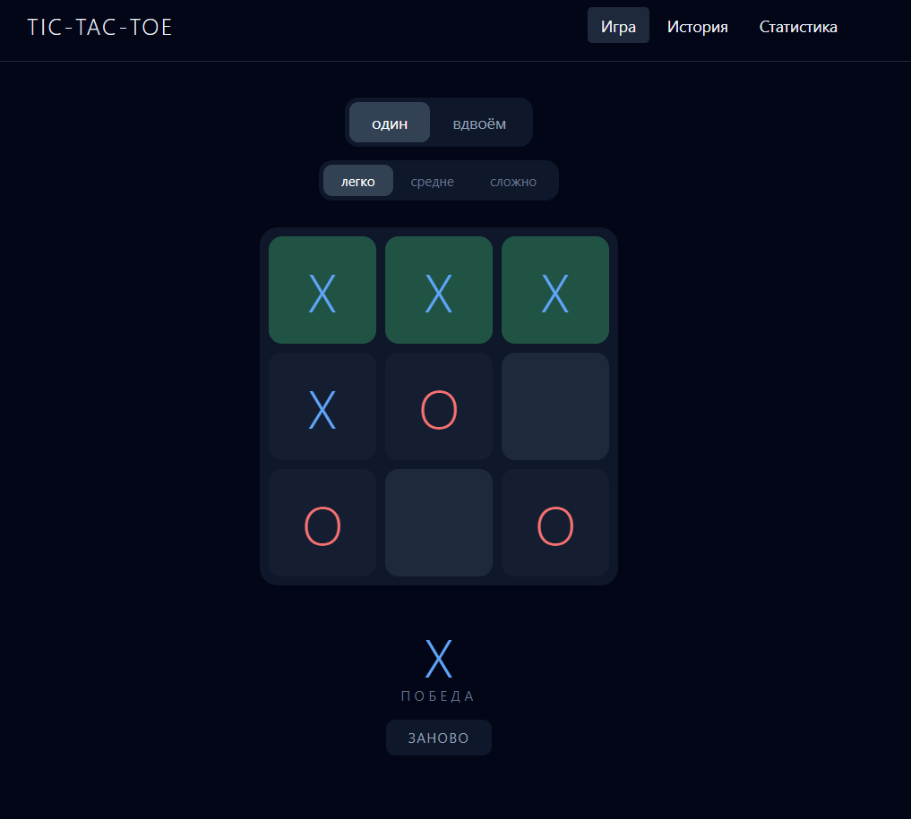

# Tic-Tac-Toe

Веб-приложение для игры в крестики-нолики на Laravel. Реализованы режим против компьютера с тремя уровнями сложности, режим для двух игроков, сохранение истории партий, пошаговый реплей и анализ ходов.



## Стек

- PHP 8.5
- Laravel 13
- SQLite
- Blade, Tailwind CSS (CDN), Vanilla JS
- Web Audio API

## Возможности

### Игра
- Режим против компьютера с уровнями сложности easy, medium, hard
- Режим для двух игроков (PvP)
- Подсказка оптимального хода

### Алгоритм
- Минимакс с альфа-бета отсечением для уровня hard
- Эвристический выбор хода для уровня medium
- Случайный ход для уровня easy

### История и анализ
- Сохранение всех завершённых партий в базе данных
- Фильтрация истории по результату и режиму игры
- Пошаговый реплей с навигацией стрелками клавиатуры
- Разбор партии: оценка каждого хода игрока и итоговая точность
- Статистика: количество побед, поражений, ничьих, процентное соотношение, средняя длина партии

## Установка

```bash
git clone https://github.com/USERNAME/tictactoe.git
cd tictactoe
composer install
cp .env.example .env
php artisan key:generate
touch database/database.sqlite
php artisan migrate
php artisan serve